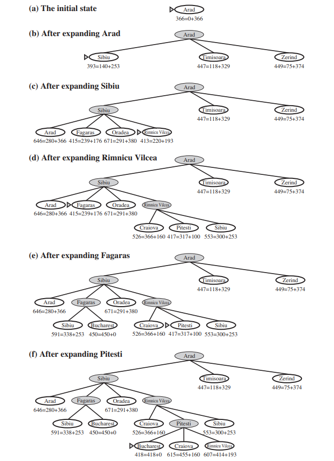

## Introduction

A* Search is an informed search algorithm for traversing a graph. A* evaluates and explores nodes by combining the cost to reach the node (g) and the cost to get from the node to the goal (h). The algorithm selects the node with the lowest f = g + h value to explore next. We typically use a priority queue (frontier) to select the node with the lowest f value for expansion. It is a fundamental algorithm used in various applications such as pathfinding, robotics, route planning, and optimization problems due to its completeness, optimality, and optimal efficiency.

## Algorithm

The A* Search algorithm is a pathfinding algorithm used to find the shortest path from a start node to a goal node in a graph, taking into account both the actual cost from the start node and an estimated cost to the goal node. The heuristic function h estimates the cost to reach the goal from node n as h(n). The cost function g(n) gives the actual cost to reach node n from the start node. The priority queue is ordered by the total cost f(n) which is the sum of g(n) and h(n). 

STEP 1: Initialize the frontier (priority queue) with the start node 'start' and set g and f values to 0 and h(start) respectively.

STEP 2: While the frontier is not empty, select the node with the lowest f value.

STEP 3: If the selected node is the goal node, reconstruct and return the path from the start node to the goal node.

STEP 4: Expand the selected node by exploring its neighbors and update the cost and parent of each neighbor. Remove the node from the frontier.

STEP 5: For each neighbor, calculate the tentative g value and update it if it is lower than the current g value.

STEP 6: Calculate the f value for each neighbor if its g value is updated and add them to the frontier if they are not already in the frontier.

STEP 7: Repeat steps 2-6 until the goal node is reached or the frontier is empty.

## Example

Reference: Figure 3.23 of Reference 1

**Intuition**
Since g(n) gives us the path cost from the start node to n and h(n) gives us the estimated cost of the cheapest path from n to the goal, essentially f(n) is the estimated cost of the cheapest solution through n.

**Optimality**
The graph-search version of A* is optimal if the heuristic function is consistent. A heuristic h(n) is considered consistent (monotonic) if, for every node n and its successor n' generated, the estimated cost of reaching the goal from n is not greater than the actual cost of reaching n' plus the estimated cost of reaching the goal from n'.

## Advantages 

Completeness: A* Search is complete, meaning that if a path exists between the start and goal nodes (i.e. a solution exists), A* is guaranteed to find it, provided certain conditions are met (such as finite graph size and consistent heuristic).

Optimality: When using an admissible heuristic (one that never overestimates the true cost to reach the goal), A* Search is optimal, meaning it will always find the shortest (or lowest) path cost between the start and goal nodes.

Efficiency: A* Search is generally efficient, especially when using an appropriate heuristic. By intelligently selecting nodes to explore based on their estimated cost, A* can often find the optimal path while exploring a relatively small portion of the search space.

## Disadvantages

Memory Intensive: A* Search may require a significant amount of memory, particularly in scenarios with large graphs or when the search space is dense. This is because it needs to store information about all the nodes it has visited and those yet to be explored.

Heuristic Dependence: The performance of A* Search heavily depends on the quality of the heuristic function used. If the heuristic is not admissible (i.e., it overestimates the true cost), A* may not find the optimal solution. Additionally, designing an effective heuristic for certain problem domains can be challenging.

Time Complexity: While A* Search is generally efficient, its time complexity can be high in certain scenarios, particularly when the graph is dense or the heuristic evaluation is expensive. In such cases, the algorithm may take longer to find the optimal path, impacting its practicality for real-time applications.
